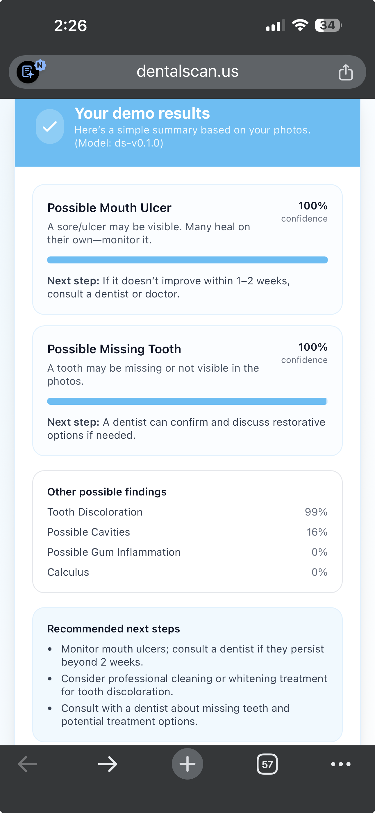

# DentalScan — Technical & UX Audit

**Note on authorship:** The prompt and raw observations below are mine (from hands-on testing at dentalscan.us). I used them as a draft brief and had an AI assistant expand them into the polished audit that follows. All findings, screenshots, and opinions are my own — the AI only handled wording and structure.

## UX observations (Discovery Scan on mobile)

- **Framing target is the wrong subject.** The guide circle asks the user to center their *face*, but the clinical subject is the *teeth*. Centering a face and then tilting for "upper/lower teeth" forces the user to guess how their jaw will land in-frame. The guide should center the **mouth/teeth**, with head-tilt instructions layered on top of that anchor. A short looped demo — a mannequin or skeleton silhouette performing the tilt — would teach the motion far faster than text copy.

- **Too much vertical UI on mobile.** The current flow behaves like a scrolling web page: header, viewport, instructions, capture button, and thumbnail strip stack past the fold so the user has to scroll to reach the shutter. On a phone the **live preview and capture button must be co-visible in one screen** — ideally the shutter floats over the viewport, with thumbnails collapsed into a small tray. Nothing about a capture flow should require scrolling.

- **No environmental pre-check.** Users start scanning in whatever light they have. A quick pre-flight ("step into bright, front-facing light") would avoid most bad captures before the camera even opens.

## Technical risks

- **AI output appears hallucinated.** The demo result (see below) returned *100% confidence* for "Possible Mouth Ulcer" and "Possible Missing Tooth" from what was effectively a blank/low-signal scan — a classic over-confident generation. The model needs stricter grounding: abstain thresholds, calibration penalties for low-evidence frames, and a "insufficient image quality" exit path rather than fabricating findings.

  

- **Single-angle captures aren't enough to constrain the model.** An **Apple Face ID-style sweep** — asking the user to slowly rotate their head while the app samples dozens of frames — would give the model far more geometry to cross-reference, and let the client drop blurry/low-light frames before upload. It also removes the "did I hold still?" failure mode of discrete captures.

- **Mobile camera stability.** `getUserMedia` behavior diverges sharply across iOS Safari, Chrome Android, and in-app webviews; autofocus hunts during head tilt; orientation changes drift overlay math. Client-side resize + per-frame quality gating is mandatory before anything hits the network.